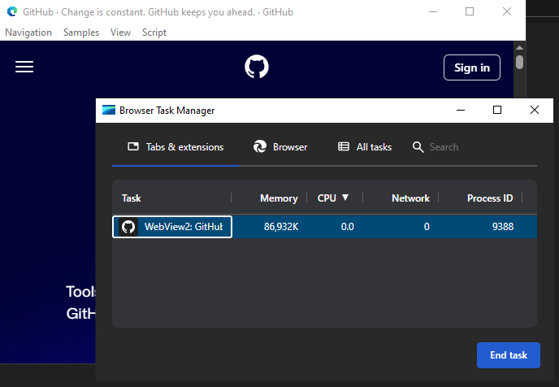

# WebView4VB6 - Microsoft Edge WebView2 Control for Visual Basic 6

Using Edge Web View in Visual Basic 6 has never been so simple. This program allows you to use Microsoft Edge WebView2 Control in your Microsoft Visual Basic 6 project and applications.

# Target user

Anyone wanting to use a modern web view in Visual Basic 6 applications.

# Supported Features

- Opening a web page, displaying html content etc...
- Calling Javascript function from Visual Basic
- Calling Visual Basic function from Javascript
- All ICoreWebView2 methods implemented

# Unsupported (yet) Features

- ICoreWebView2_2 to ICoreWebView2_17 methods

# Installation

Download WebView2 Runtime from Microsoft website

1. Create a Visual Basic 6 project

2. Add WebView.ctl control

3. Add a reference to WebView2.{version_number}.tlb

4. Copy WebView2Loader.dll to project folder or use your own WebView Runtime

> [!IMPORTANT]
> Distributed VB6 executables may appear as viruses; simply let your antivirus software remove them and compile the project you need from Visual Studio.

> [!CAUTION]
> The end user's computer must have the runtime installed to use your application, or you must embed it. Refer to the WebView manual.

Enjoy
